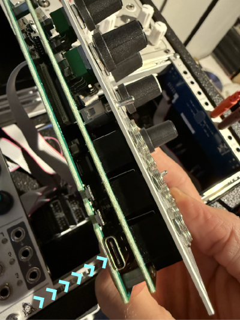
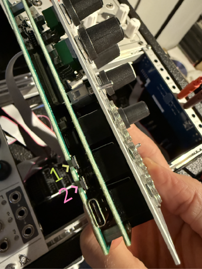

# Silhouette Eurorack Module Firmware

Here you'll find firmware updates for Silhouette.

Get the [Latest Firmware](https://github.com/whimsicalraps/Silhouette/releases/latest).

You can view & download historical versions by viewing [Releases](https://github.com/whimsicalraps/Silhouette/releases). Each version has notes on the changes made for the given release.

## How to update

You'll need to access the left edge of the module, so either remove it slightly from the case, or remove the module to the left of Silhouette. You can turn off your Eurorack's power while attaching the USB cable to be extra safe, but we want to keep the module powered throughout the rest of this process.

### Download new firmware file

* Download the [Latest Firmware](https://github.com/whimsicalraps/Silhouette/releases/latest), or an older version if you need to downgrade
* The firmware file has a `.uf2` extension
* Open a file browser and locate this file, which is likely in your `Downloads` folder

### Locate the USB-C port

On the lower of the two circuit boards, at the left edge, beneath the input jacks, you'll find a USB-C port:

Connect this port to your computer with an appropriate cable.

### Enter the bootloader

Find the two buttons next to the USB port:

* Press and hold them both at the same time, which turns the module off
* Release the button nearest the top of the module (`1` in the above image)
* Then release the button immediately next to the USB port (`2` in the above image)

Silhouette will appear as a removable disk drive on your computer. It will be called `RPI-RP2`.

If you don't see a disk drive appear, try pressing the button sequence again, adding a longer pause between releasing the first button and then the second button.

### Upload the firmware

* Drag-and-drop the the firmware file (eg. `Silhouette_v111.uf2`) onto the removable disk drive that appeared

The file will take a few seconds to copy, after which Silhouette will automatically restart and you'll see the removeable disk drive on your computer self-eject.

Your firmware is now up to date!
